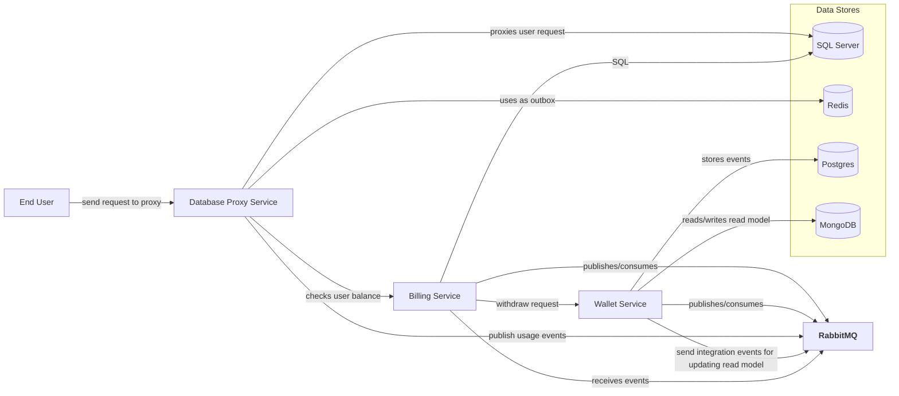
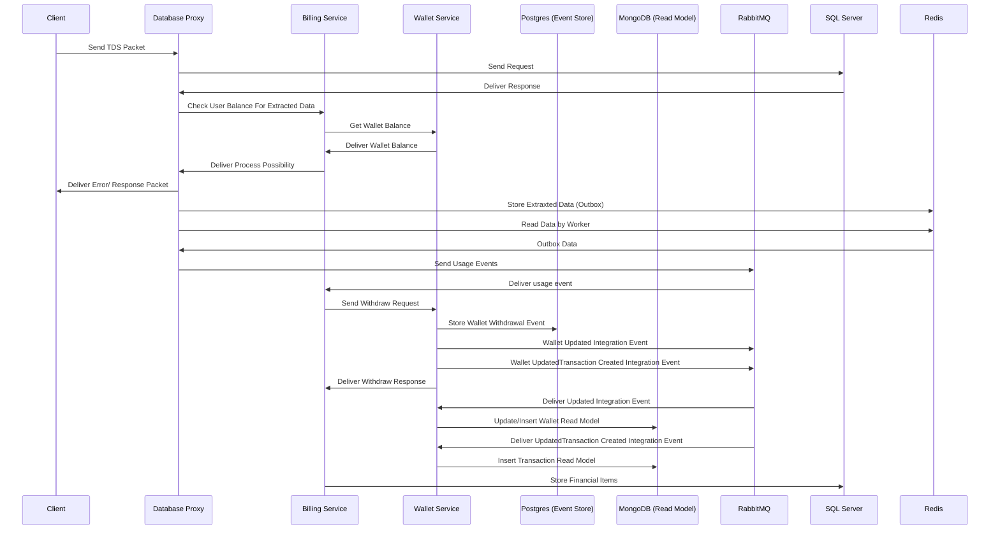

# مشخصات نیازمندی‌های نرم‌افزار (SRS)

## مقدمه
- **هدف:** ارائه راهکاری برای مدیریت درخواست‌های کاربران، محاسبه میزان استفاده، و صدور صورتحساب در سرویس QueryPay.
- **محدوده:** سیستم شامل سه سرویس اصلی کیف پول، صورتحساب و پروکسی دیتابیس می‌باشد.

## نیازمندی‌های عملکردی
-**سرویس کیف پول:**
   - ایجاد کیف پول جدید.
   - مدیریت تراکنش‌ها (افزایش/کاهش موجودی).
   - ارائه اطلاعات کیف پول.

-**سرویس پروکسی دیتابیس:**
   - آنالیز بسته‌های ارسالی کاربران.
   - ذخیره داده‌ها در Redis و ارسال به RabbitMQ.
   - بررسی موجودی کاربران و ارسال پاسخ.

-**سرویس صورتحساب:**
   - صدور صورتحساب برای کاربران.
   - بررسی امکان انجام تراکنش بر اساس داده‌های آنالیز شده.

## نیازمندی‌های غیرعملکردی
- **مقیاس‌پذیری:** سیستم باید توانایی مدیریت همزمان حجم زیادی از تراکنش‌ها را داشته باشد.
- **مانیتورینگ:** باید سیستم لاگ های مهم را دخیره کند و توانایی رهگیری درخواست در کل سیستم وجود داشته باشد.(پیاده سازی نشده و باید با OpenTelemetry پیاده سازی شود)
- **کارایی:** زمان پاسخگویی سرویس‌ها باید حداقل باشد.

## فناوری‌های مورد استفاده
- **زبان‌ها:** Go (پروکسی دیتابیس)، C# (کیف پول و صورتحساب).
- **دیتابیس‌ها:** Redis، PostgreSQL، MongoDB، SQL Server.
- **ارتباطات:** RabbitMQ به‌عنوان Message Broker.


# تصمیم‌نامه‌های معماری (ADR)

## تصمیم 1: استفاده از معماری Clean Architecture و DDD
- **موضوع:** انتخاب معماری برای مدیریت سرویس‌های سیستم
- **دلایل:**
  - افزایش قابلیت نگهداری و انعطاف‌پذیری.
  - جداسازی منطقی لایه‌ها و ارتباطات.
  - پشتیبانی از رویکرد Event Sourcing برای سرویس Wallet.
- **جایگزین‌ها:** معماری‌های Monolithic یا Service-Oriented Architecture.
- **نتیجه:** استفاده از Clean Architecture با رویکرد DDD برای تمامی سرویس‌ها.

## تصمیم 2: انتخاب دیتابیس‌های مختلف
- **موضوع:** استفاده از دیتابیس‌های خاص برای هر سرویس.
- **دلایل:**
  - دیتابیس Redis برای سرعت بالا در خواندن/نوشتن در پروکسی.
  - دیتابیس MongoDB برای مدل‌های خواندنی سرویس Wallet به دلیل مقیاس‌پذیری.
  - دیتابیس PostgreSQL برای Event Store به دلیل پشتیبانی از JSONB و سرعت بالا.
  - دیتابیس SQL Server برای سرویس Billing به دلیل حجم بالای تراکنش‌ها.
- **جایگزین‌ها:** استفاده از یک دیتابیس عمومی مانند MySQL.
- **نتیجه:** استفاده از چندین دیتابیس تخصصی.

## تصمیم 3: استفاده از RabbitMQ
- **موضوع:** مدیریت ارتباط بین سرویس‌ها.
- **دلایل:**
  - قابلیت اعتماد بالا در ارسال پیام‌ها.
  - پشتیبانی از الگوهای مختلف صف‌سازی.
- **جایگزین‌ها:** Apache Kafka یا AWS SQS.
- **نتیجه:** انتخاب RabbitMQ به‌عنوان Message Broker اصلی.


## System Design 

### High-Level Architecture


### Squence Diagram


# Folder Structure
```bash
QueryPay/
├── certificates/
│   ├── cert1.pem
│   └── cert2.pem
├── services/
│   ├── billing/
│   │   ├── src/
│   │   │   ├── BillingService.cs
│   │   │   └── ...
│   │   ├── tests/
│   │   │   ├── BillingServiceTests.cs
│   │   │   └── ...
│   │   ├── Dockerfile
│   │   └── ...
│   ├── database-proxy/
│   │   ├── src/
│   │   │   ├── ProxyService.go
│   │   │   └── ...
│   │   ├── tests/
│   │   │   ├── ProxyServiceTests.go
│   │   │   └── ...
│   │   ├── Dockerfile
│   │   └── ...
│   └── wallet/
│       ├── src/
│       │   ├── WalletService.cs
│       │   └── ...
│       ├── tests/
│       │   ├── WalletServiceTests.cs
│       │   └── ...
│       ├── Dockerfile
│       └── ...
├── .env
├── .gitignore
├── README.md
└── docker-compose.yml
```
