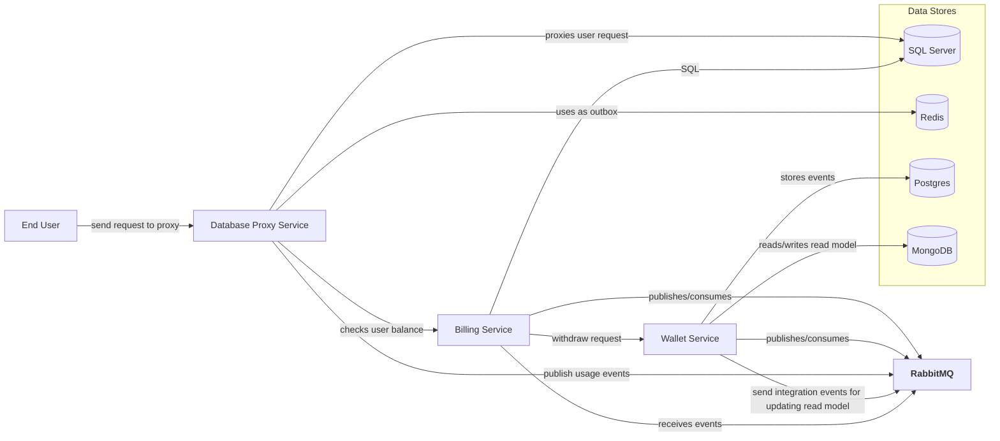

## System Design 

### High-Level Architecture


### Squence Diagram
```mermaid
sequenceDiagram
    participant U as Client
    participant DP as Database Proxy
    participant BS as Billing Service
    participant WS as Wallet Service
    participant PG as Postgres (Event Store)
    participant MG as MongoDB (Read Model)
    participant RQ as RabbitMQ
    participant SS as SQL Server
    participant R as Redis
    

    U->>DP: Send TDS Packet
    DP->>SS: Send Request
    SS->>DP: Deliver Response
    DP->>BS: Check User Balance For Extracted Data
    BS->>WS: Get Wallet Balance
    WS->>BS: Deliver Wallet Balance
    BS->>DP: Deliver Process Possibility
    DP->>U: Deliver Error/ Response Packet
    DP->>R: Store Extraxted Data (Outbox)
    DP->>R: Read Data by Worker
    R->>DP: Outbox Data
    DP->>RQ: Send Usage Events
   
    RQ->>BS: Deliver usage event
    BS->>WS: Send Withdraw Request
    WS->>PG: Store Wallet Withdrawal Event
    WS->>RQ: Wallet Updated Integration Event
    WS->>RQ: Wallet UpdatedTransaction Created Integration  Event
    WS->>BS: Deliver Withdraw Response
    RQ->>WS: Deliver Updated Integration Event
    WS->>MG: Update/Insert Wallet Read Model
    RQ->>WS: Deliver UpdatedTransaction Created Integration  Event
    WS->>MG: Insert Transaction Read Model 

   BS->>SS: Store Financial Items  

