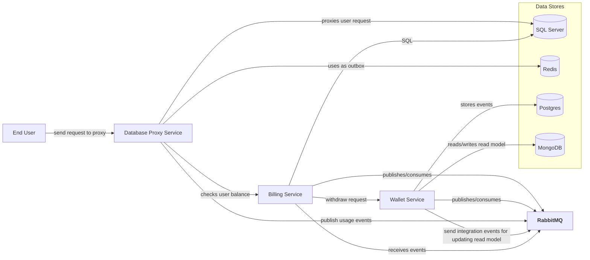

## System Design 

### High-Level Architecture


### Squence Diagram
```mermaid
sequenceDiagram
    participant U as User
    participant WS as Wallet Service
    participant PG as Postgres (Event Store)
    participant MG as MongoDB (Read Model)
    participant RQ as RabbitMQ
    participant BS as Billing Service
    participant SS as SQL Server
    participant DP as Database Proxy

    U->>WS: Create Wallet Request
    WS->>PG: Store WalletCreated Event
    WS->>MG: Update/Insert Read Model
    WS->>RQ: Publish "WalletCreated" Event

    Note over RQ: RQ routes event to subscribers

    BS->>RQ: Subscribes "WalletCreated" (optional)
    U->>BS: Create Invoice & Pay Invoice
    BS->>SS: Insert Invoice Record (via DP or direct)
    BS->>RQ: Publish "InvoicePaid"

    RQ->>WS: Deliver "InvoicePaid"
    WS->>PG: Store WalletDebited Event
    WS->>MG: Update Read Model
    WS->>RQ: Publish "WalletUpdated"

    RQ->>BS: Deliver "WalletUpdated"
    BS->>SS: Update Invoice Status (paid)
    U->>BS: Check Invoice Status
    BS->>SS: Query
    BS->>U: Return final status

